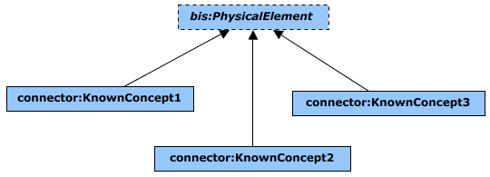
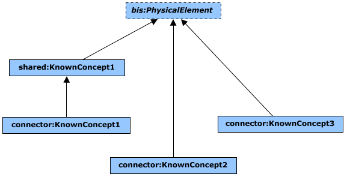
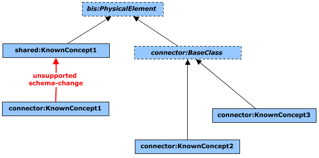

# Schema Design Recommendations and Guidelines

## General Recommendations

- Focus on one modeling perspective per schema. That is, separate concepts focusing on _Physical_ modeling from concepts implementing _Analytical_ or _Functional_ modeling, each into their own schema. This separation becomes mandatory if the target schemas are meant to be shared. In that case, the target [schema-layer](../intro/bis-organization.md) for the resulting schemas will be different (e.g. _Discipline-Physical_ vs. _Discipline-Other_). It is fine for the _Physical_ schema to include `SpatialLocationElement` subclasses and definition and other information classes used for physical modeling.
- Some authoring workflows in certain disciplines are complex and need special algorithms based on helper recipe-like concepts. The output from these complex algorithms is typically the real-world entities being modeled. In such situation, it is important to separate those concepts into different schemas. That is, the helper concepts of an authoring workflow are typically considered application-specific and should be defined in an Application-layer schema. The concepts associated to the real-world entities being modeled should be defined in a separate schema. The latter is typically a candidate to be defined at a lower schema-layer (e.g. Discipline-Physical or Discipline-Other) for the applicable discipline, if appropriate.
- In general, mixins should not have any properties defined in them. They lead to complex UNION queries in iModels, causing a slow-down in data retrieval from them.
- Only make use of dynamic schemas (generated at runtime) to capture concepts that truly vary per iModel. If a given connector has some connector-specific fixed concepts, capture them in an Application-layer schema and have any dynamic classes subclass those Application-layer classes. This makes it easier for downstream consumers to understand what is fixed and what is dynamic.

## Element Classification Recommendations

See [Classifying Elements](../fundamentals/data-classification.md#general-recommendations) for general recommendations about the classification of element-semantics.

## Lower-layer schemas

Schemas at the Core, Common or Discipline layers are meant to be shared by multiple use-cases. The lower the layer of a schema, the more widely used it is expected to be. With that in mind, the following recommendations are especially useful for shared schemas:

- Study other schema ecosystems and formats covering the domain of interest for inspiration.
- Create a list of the main terms and their definitions in your domain. They typically lead to the primary data-classification scheme, which translates into the main element-classes to be introduced.
- Typically every primary data-classification concept defined as sub-classes of bis:GeometricElement3d can be further sub-classified. Therefore, consider to introduce a type-definition class for every concrete element-class defined under the bis:GeometricElement3d class-branch.
- Keep in mind that lower-layer schemas can be targeted by both iModel Connectors and authoring apps. The former typically need more flexibility while organizing elements into models that are synchronized from external sources. That is due to the different degrees of semantical richness built into the external data that iModel Connectors have to deal with. Therefore, study the semantics available in external formats to applicable iModel Connectors in your domain before introducing rigid element-organization mandates. On the other hand, authoring BIS-based applications are typically designed with a high degree of semantical understanding over their domain data, which makes them more adaptable to rigid data-structures.

## iModel Connector schemas

- Use an existing element-class or type-definition class from a schema at the Discipline-Physical or Discipline-Other layers of BIS as target of the mapping done by an iModel Connector when possible.
- Make use of Type-Definitions when appropriate in order to avoid an unnecessary large number of classes in a schema.
- Categorize properties from the source format into:

  1. **Standard - intrinsic** to the primary or secondary classification of its owning concept. These are candidates to be first-class properties on an _Element_ or _TypeDefinition_ class.
  2. **Standard - not intrinsic** to the classification of its owning concept. These are candidates to be captured in an _Aspect_ class.
  3. **User-defined**. These should be captured by an _Aspect_ class in a dynamic schema (generated at runtime).

  Another way to think about it is to ask if a given set of properties would appear on many different classes. If there is a single natural "base class" for all of the classes that need those properties and only classes that need those properties, then it makes sense to add the properties to that _Element Class or_ its related _TypeDefinition_ class. Otherwise, it may be better to use an _Aspect_ class.

- With respect to concepts whose semantics are understood by the iModel Connector but there is not a corresponding class in a schema at the Discipline-Physical or Discipline-Other layers of BIS yet, it is recommended that the Connector directly subclasses the appropriate base-class of the `BisCore` schema. Typically, they are the `PhysicalElement` and `SpatialLocationElement` base-classes. BIS schemas are continously evolving, so when the missing concept is added to a shared-layer schema, a iModel Connector that introduced separate classes for previously missing concepts just needs to inject the new concept as the base class of its existing class. The following two class-diagrams show such a situation:

  | Before "concept1" is introduced in a shared BIS schema                         | After "concept1" is introduced in a shared BIS schema                        |
  | ------------------------------------------------------------------------------ | ---------------------------------------------------------------------------- |
  |  |  |

  Avoid introducing an intermediate base-class in the iModel Connector schema for this kind of classes. They will get in the way of re-targeting a more appropriate base-class from a schema in the Discipline-Physical or Discipline-Other layers if the iModel Connector is able to understand the concept's semantics at a later time. The following two class-diagrams depict such a situation:

  | Before "concept1" is introduced in a shared BIS schema. iModel Connector introduced a common base-class for known concepts with no target in BIS. | After "concept1" is introduced in a shared BIS schema. The iModel Connector base-class gets in the way while trying to align the corresponding concrete class. |
  | ------------------------------------------------------------------------------------------------------------------------------------------------- | -------------------------------------------------------------------------------------------------------------------------------------------------------------- |
  |                                                                   |                                                                                  |

- Regarding concepts whose semantics are not understood by the iModel Connector, they can be addressed by:

  1. Discern, or make a good guess, about the general classification of the concept in terms of _BisCore_ base-classes. That is, choosing between `PhysicalElement`, `SpatialLocationElement` or `DrawingGraphic`.
  2. Either:

     a) Directly subclass the chosen base-class from the _BisCore_ schema if Standard-intrinsic properties need to be introduced on such concept, or,

     b) Target the appropriate class from the `Generic` schema - e.g. `PhysicalObject` or `SpatialLocation`.

  If at a later time, the external format and the iModel Connector evolve to understand a concept applicable to a subset of elements already mapped to a single generic class, the iModel Connector will have to recreate those elements in the iModel under a more appropriate class. Such process may be disruptive for existing consumers of its output. Please keep the following recommendations in mind in order to minimize or mitigate its impact:

  1. Try to reuse the _ElementId_ of an element being recreated.
  2. Preserve any unique and global identifiers from the element being deleted into the new one. The most important properties in that category are `Code` and `FederationGuid`.
