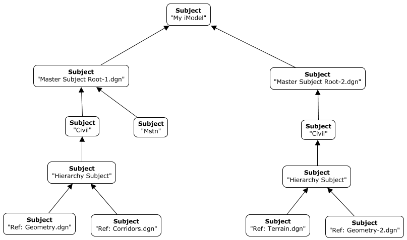
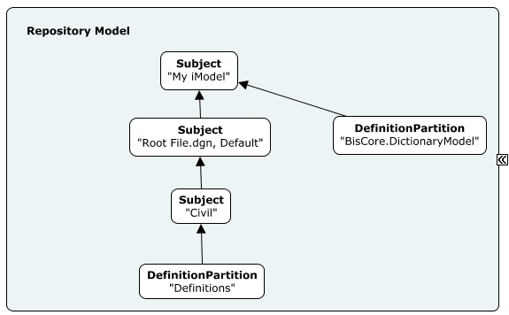
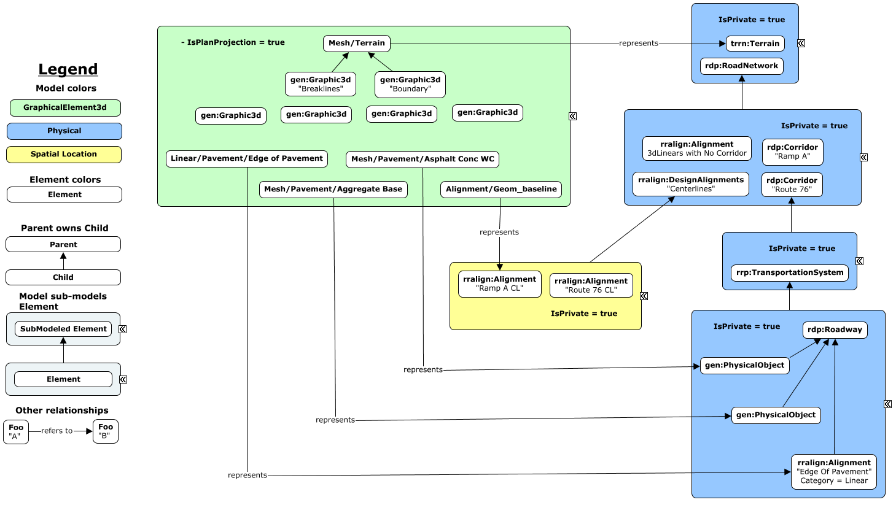
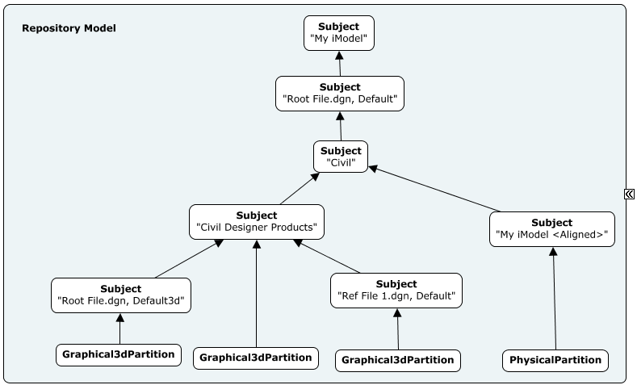
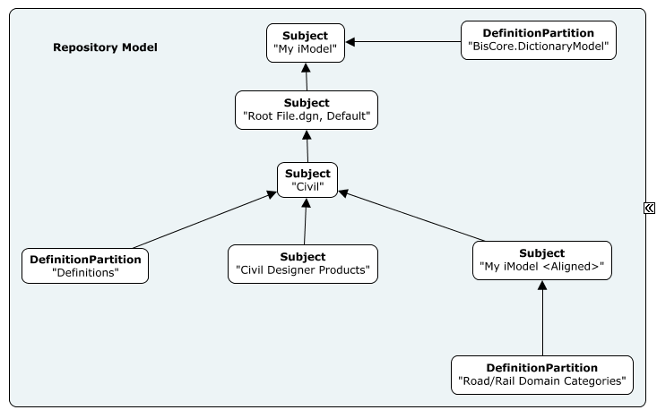
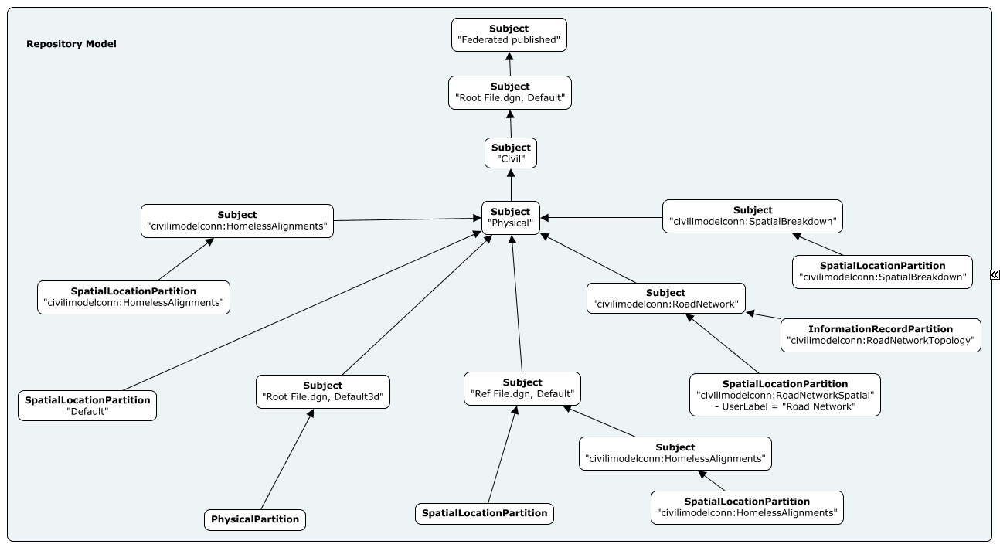
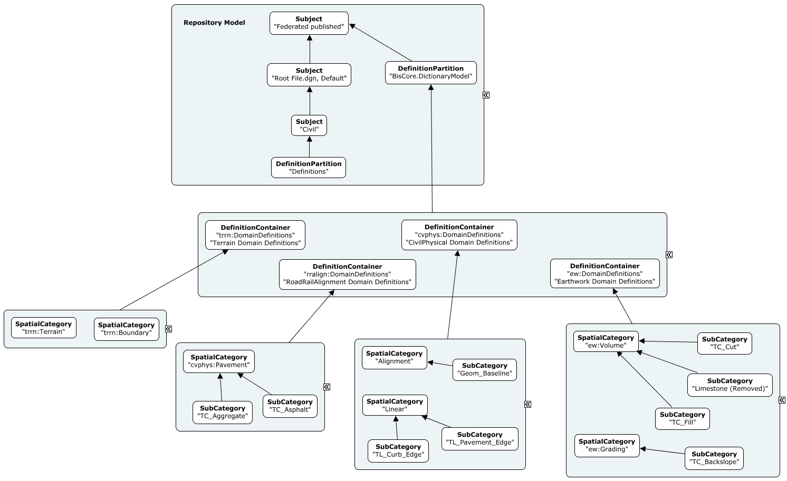
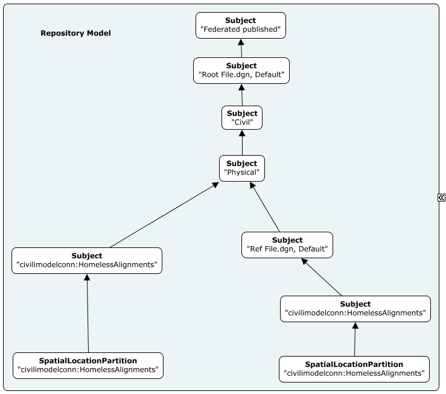

## Table of Content

- [Introduction](#introduction)
- [General Topics](#general-topics)
  - [Spatial root model identification](#spatial-root-model-identification)
  - [Subject hierarchy](#subject-hierarchy)
  - [Definition Elements](#definition-elements)
  - [Presentation properties from Civil Designer applications](#presentation-properties-from-civil-designer-applications)
  - [Quantity Takeoff mappings](#quantity-takeoff-mappings)
- [V1 approach](#v1-approach)
  - [Target BIS schemas](#target-bis-schemas---v1-approach)
  - [Subject hierarchy](#subject-hierarchy---v1-approach)
  - [Definition Elements](#definition-elements---v1-approach)
  - [Quantity Takeoff mappings](#quantity-takeoff-mappings---v1-approach)
  - [Linear Referencing](#linear-referencing---v1-approach)
- [V2 approach](#v2-approach)
  - [Target BIS schemas](#target-bis-schemas---v2-approach)
  - [Subject hierarchy](#subject-hierarchy---v2-approach)
  - [Definition Elements](#definition-elements---v2-approach)
    - [Type Definitions](#type-definitions)
  - [Code Values](#code-values-v2-approach)
  - [Quantity Takeoff mappings](#quantity-takeoff-mappings---v2-approach)
  - [Linear Referencing](#linear-referencing---v2-approach)
  - [Spatial Composition](#spatial-composition)
  - [Road Network](#road-network)
  - [Rail Network](#rail-network)

## Introduction

The Bentley Civil iModel Connector synchronizes iModels from data authored by Bentley's Civil Designer applications, namely:

* OpenRoads Designer
* OpenRail Designer
* OpenBridge Modeler
* OpenSite Designer

It supports two behaviors, or approaches, when it comes to element-organization and supported semantics. They are referred to as the "V1" and "V2" approaches.

The "V1" approach was introduced since the very first version of the Bentley Civil iModel Connector, while the "V2" approach was developed more recently based on evolutions in IFC 4x3, Bentley's Civil Designer applications and BIS in general.

Both approaches will be supported in parallel for the foreseable future, but the "V2" approach is recommended since it offers the richest data for downstream services in the cloud.

The Bentley Civil iModel Connector supports dgn datasets authored by CONNECT editions (version 10.07 and later) of the aforementioned Bentley Civil Designer applications.

## General Topics

### Spatial root model identification

Most dgn-files generated from Bentley's Civil Designer applications have a two-model setup:

1) A 2D model capturing the plan/top view of the project, and
2) A 3D model containing the full rendering of the data with elevation.

Most user-provided data is stored in the 2D model, while data in the 3D model is mostly generated from the 2D model. Additionally, the 2D model typically references its corresponding 3D model.

As a result, these 2D models are very important in light of the Bentley Civil iModel Connector's ability to reach all data contained in dgn-files generated from Bentley's Civil Designer applications. Furthermore, since these 2D models generally captured geographically-located data, the connector treats them as spatially-located models instead of Drawing models.

Based on these reasons, the Bentley Civil iModel Connector always aims to start publishing a dataset starting at the 2D model of the provided root or container dgn file. Therefore, a container dgn file shall be setup in such a way that it ensures all the reference-attachments are reachable and visible accordingly.

It highly is recommended that the root or container dgn for a dataset to be used to synchronize an iModel by the connector follows the [Best Practices for Creating a Civil iModel](<https://communities.bentley.com/products/road___site_design/w/road_and_site_design__wiki/50786/best-practices-for-creating-a-civil-imodel>).

### Subject hierarchy

Most of the elements in the subject hierarchy generated by the Bentley Civil iModel Connector does not change with the approach used. The following table describes the different levels of `bis:Subject` instances that it creates as well as the helper tag stored in their JsonProperties attribute.

| Subject level | Multiplicity | Helper JsonProperties tag |
| ------------- | ------------ | ------------------------- |
| Root | One instance per iModel | |
| Master | One instance per container / root dgn file | ```{"Subject":{"Model":{"Type":"SourceMasterModel"} } }``` |
| Job | One instance per iModel Connector publishing from the same container / root dgn - e.g. "Civil" | ```{"Subject":{"Job":{ } } }``` |
| Hierarchy | One instance for each Job Subject | ```{"Subject":{"Model":{"Type":"Hierarchy"} } }``` |
| Reference | One instance for each reference-attachment in the dgn dataset | ```{"Subject":{"Model":{"Type":"References" } } }``` |

The following instance diagram shows an example of the multiple levels of subjects in an iModel published by the Civil iModel Connector:



The approach version used in a Job subject is captured in its JsonProperties as:
```{"Subject":{"Job":{"Properties":{"CifConverterVersion": x} } } }```.

With x = 1 for the V1 approach and x = 2 for the V2 approach. If such Json attribute is missing, V1 approach is assumed.

### Definition Elements

In general, Definition elements are stored in one of two models in an iModel, depending on the case. Those models are:

1) The global iModel's Dictionary model.
2) The Job's "Definitions" model.

The following instance diagram depicts the location of the `bis:DefinitionPartition`s, leading those definition models, in light of an iModel's subject hierarchy:



The following table depicts the default mappings used with respect to Definition Elements while publishing a dgn file:

| dgn-file concept | iModel concept | Target model |
|----------------- | -------------- | ------------ |
| Annotation style | bis:AnnotationTextStyle | Job's "Definitions" model |
| Level | bis:SpatialCategory or bis:DrawingCategory | DictionaryModel or Job's "Definitions" model |
| Line style | bis:LineStyle | DictionaryModel |
| Material | bis:RenderMaterial and bis:Texture | DictionaryModel |
| Shared-cell | bis.GeometryPart | Job's "Definitions" model |
| View | bis:DrawingViewDefinition or bis:SpatialViewDefinition or bis:SheetViewDefinition, with supporting bis:ModelSelector, bis:DisplayStyle2d or bis:DisplayStyle3d | Job's "Definitions" model |

### Presentation properties from Civil Designer applications

All properties shown in the supported Civil Designer applications are mapped to a corresponding `bis:ElementUniqueAspect` class from one of the CifXXX BIS schemas. They are [Grade C](https://www.itwinjs.org/bis/intro/bis-organization/#bis-compatibility-grades-for-schemas) schemas meant to provide a similar experience to the originating application. These aspects are attached to the appropiate `bis:GeometricElement` instance.

### Quantity Takeoff mappings

The Bentley Civil iModel Connector also publishes Quantity Takeoff values, including volume, surface area, top-surface area and material name, in terms of the `QuantityTakeoffsAspects` schema. In general, note that this leads to duplication of data since it is also published in terms of the corresponding CifXXX schema. This behavior is intentional since the former schema is of a higher grade than the latter, and therefore, considered aligned for generic services downstream.

## V1 approach

The "V1" approach is currently the default output from the Bentley Civil iModel Connector. Since it was developed before the introduction of the SpatialComposition schema in BIS and richer-semantics in the Civil Designer Products, it mostly aims at achieving visual fidelity and synchronizing presentation properties from them.

Without the semantics-oriented enhancements recently introduced in the Civil Designer Products, the connector truly only understands `Alignments`, `Corridors`, `Corridor Surfaces` and `Digital Terrain Models`. Since datasets from Civil Designer Products typically contain many other elements whose semantics the software does not understand without human intervention, the Bentley Civil iModel Connector "V1 approach" creates two branches in the subject hierarchy of its iModels:

* Branch #1, aimed at visual fidelity, treats all elements as graphics - that is, subclasses of `bis:GraphicalElement3d`.
* Branch #2, captures the semantics the Bentley Civil iModel Connector is able to understand from a dataset. Elements in this branch are published in terms of the relevant BIS schemas such as `RoadRailAlignment` or `RoadRailPhysical`.

A model in branch #1 is created for each model in a dgn file. If a model in a dgn file is normal 2D, the `IsPlanProjection` property of the mapped model in the iModel will be set to `true`. Otherwise, such property will be left as `false` (default value). Objects in the Civil Designer dataset that are not *featurized* or whose `Feature Definition` is not accesible are mapped to `generic:Graphic3d` in branch #1 by default.

Models in branch #2 are created by following the expected hierarchy in the corresponding [BIS schemas](#Target-BIS-schemas) being target. This model hierarchy take advantage of the sub-modeling capabilities in BIS. These models are marked as private (that is, their `IsPrivate` model-property is set to `true`), preventing them from being displayed by default, in order to avoid visual confusion with models in branch #1. Furthermore, elements in branch #2 are typically associated with graphical elements in branch #1 via `bis:GraphicalElement3dRepresentsElement` relationships, as depicted in the following instance diagram.



A job published to an iModel with the V1 approach cannot be converted to a V2 approach in place. Unmapping the job and recreating it with the desired approach is required.

### Target BIS schemas - V1 approach

#### Core:
* [BisCore](https://www.itwinjs.org/bis/domains/biscore.ecschema/)
* [Generic](https://www.itwinjs.org/bis/domains/generic.ecschema/)

#### Linear Referencing:
* [LinearReferencing](https://www.itwinjs.org/bis/domains/linearreferencing.ecschema/)
* [RoadRailAlignment](https://www.itwinjs.org/bis/domains/roadrailalignment.ecschema/)

#### Physical-modeling
* [RoadRailPhysical](https://www.itwinjs.org/bis/domains/roadrailphysical.ecschema/)
* [RoadPhysical](https://www.itwinjs.org/bis/domains/roadphysical.ecschema/)
* [RailPhysical](https://www.itwinjs.org/bis/domains/railphysical.ecschema/)
* [StructuralPhysical](https://www.itwinjs.org/bis/domains/structuralphysical.ecschema/)
* [BridgeStructuralPhysical](https://www.itwinjs.org/bis/domains/bridgestructuralphysical.ecschema/)
* Terrain

#### Properties from Bentley's Civil Designer applications
* [CifCommon](https://www.itwinjs.org/bis/domains/cifcommon.ecschema/)
* [CifGeometricRules](https://www.itwinjs.org/bis/domains/cifgeometricrules.ecschema/)
* [CifBridge](https://www.itwinjs.org/bis/domains/cifbridge.ecschema/)
* [CifRoads](https://www.itwinjs.org/bis/domains/cifroads.ecschema/)
* [CifRail](https://www.itwinjs.org/bis/domains/cifrail.ecschema/)
* [CifHydraulicAnalysis](https://www.itwinjs.org/bis/domains/cifhydraulicanalysis.ecschema/)
* [CifHydraulicResults](https://www.itwinjs.org/bis/domains/cifhydraulicresults.ecschema/)
* [CifSubsurface](https://www.itwinjs.org/bis/domains/cifsubsurface.ecschema/)
* [CifSubsurfaceConflictAnalysis](https://www.itwinjs.org/bis/domains/cifsubsurfaceconflictanalysis.ecschema/)

#### Quantity Takeoffs
* [QuantityTakeoffsAspects](https://www.itwinjs.org/bis/domains/quantitytakeoffsaspects.ecschema/)
* [CifQuantityTakeoffs](https://www.itwinjs.org/bis/domains/cifquantitytakeoffs.ecschema/)

#### Units & formats
* [RoadRailUnits](https://www.itwinjs.org/bis/domains/roadrailunits.ecschema/)
* [CifUnits](https://www.itwinjs.org/bis/domains/cifunits.ecschema/)

#### Dynamic schemas
* CivilDesignerProductsDynamic: Dynamic schema generated at runtime by the Bentley Civil iModel Connector based on the Feature Definitions used in a particular dataset. The generated dynamic classes subclass `bis:GraphicalElement3d`.
* DgnCustomItemTypes_XXX: Dynamic schemas generated at runtime by the connector for each Item-Type schema in a particular dataset.

### Subject hierarchy - V1 approach

As introduced [earlier](#subject-hierarchy), the "V1 approach" creates two branches in the subject hierarchy of its iModels:

* Branch #1, aimed at visual fidelity, treats all elements as graphics. That translates into a single `bis:GraphicalPartition3d` instance per leaf-`Subject` in the subject-hierarchy, starting at its "Hierarchy Subject".
* Branch #2, captures the semantics the Bentley Civil iModel Connector is able to understand from a dataset. That translates into a single `bis:Subject` instance under the "Job Subject", whose code ends with "< Aligned >", plus a single `bis:PhysicalPartition` instance under it.

The following diagram depicts the two branches for a particular job:



### Definition Elements - V1 approach

Beyond the [general mappings](#definition-elements) provided for definition elements, two domains that the V1 approach depends on store their definition elements under the "Aligned" branch. The following table and instance diagram depicts the organization of these domain-level definition elements:

| Domain | Definition Elements | Definition Partition |
| ------ | ------------------- | ----- |
| RoadRailAlignment | `Alignment`, `Linear`, `Vertical` categories | Road/Rail Domain Categories |
| RoadRailPhysical | `Network`, `Corridor`, `Roadway`, `Railway` categories | Road/Rail Domain Categories |



### Quantity Takeoff mappings - V1 approach

Under the V1 approach, `bis:ElementUniqueAspect`s from the `QuantityTakeoffsAspects` schema are only attached to the `bis:GraphicalElement3d` instances.

### Linear Referencing - V1 approach

Instances of `rralign:Alignment` are created under the "Aligned" subject hierarchy, with the corresponding graphical representations.

Actual linear locations are stored in the iModel by following the specifications set by the LinearReferencing BIS schema.

## V2 approach

The "V2" approach was introduced as an alternative output from the Bentley Civil iModel Connector, taking advantage of more recent developments such as:

* IFC 4x3's evolution on Road, Rail and Bridge domains.
* New functionality capturing richer semantics released with Bentley's OpenRoads Designer v10.10.
* New network topology functionality released with Bentley's OpenRail Designer v10.10.
* New Spatial Composition paradigm in BIS schemas and iTwin services in general.

As a result, not only new BIS schemas were introduced but also a new mapping algorithm was needed from the connector. The highlights of the V2 approach include:

* Normal 2D models from Civil Designer dgns are now mapped to `bis:SpatialLocationModel`s, with their `IsPlanProjection` property set to `true`.
* 3D models from Civil Designer dgns are now mapped to `bis:PhysicalModel`s.
* Elements from Civil Designer dgns are now directly mapped to either an aligned BIS class, or a class from the Generic BIS schema. No separate graphical representation elements are created anymore.
* No dynamic schema is created based on Feature Definitions.
* When semantics are present in the dgn dataset, a Spatial breakdown tree is created, storing those semantics in terms of the paradigms introduced by the SpatialComposition BIS schema. At the time of this writing, this is only possible with data from OpenRoads Designer and OpenBridge Modeler. Support for Spatial breakdown Other Civil Designer applications
* Feature Definitions are now captured via appropriate subclasses of `bis:TypeDefinitionElement`. The richness of such subclasses depend on the presence of semantics in the dgn dataset.
* Instances of `bis:PhysicalMaterial` are now created, capturing the understanding of construction materials by the connector. The Feature Definition name is used as a last resource when the connector does not understand any specifics about the material associated to an element.
* A Road network can be optionally inferred based on alignments and semantics available in an OpenRoads Designer dataset.
* A Rail network can be optionally published based on topology data available in an OpenRail Designer dataset.
* Objects whose semantics are not understood by the connector are mapped to the `generic:SpatialLocation` and `generic:PhysicalObject` BIS classes by default, depending whether they are contained in a 2D or 3D model in the dgn file.

The V2 approach is optional, only turned on via the `civil-imodel-connector-cifconverterv2` feature-flag.

A job published to an iModel with the V2 approach cannot be converted to a V1 approach in place. Unmapping the job and recreating it with the desired approach is required.

### Target BIS schemas - V2 approach

#### Core:
* [BisCore](https://www.itwinjs.org/bis/domains/biscore.ecschema/)
* [Generic](https://www.itwinjs.org/bis/domains/generic.ecschema/)

#### Linear Referencing:
* [LinearReferencing](https://www.itwinjs.org/bis/domains/linearreferencing.ecschema/)
* [RoadRailAlignment](https://www.itwinjs.org/bis/domains/roadrailalignment.ecschema/)

#### Physical-modeling
* CivilPhysical
* Earthwork
* [StructuralPhysical](https://www.itwinjs.org/bis/domains/structuralphysical.ecschema/)
* Terrain

#### Spatial Composition
* [SpatialComposition](https://www.itwinjs.org/bis/domains/spatialcomposition.ecschema/)
* BridgeSpatial
* RoadSpatial

#### Networks
* NetworkTopology
* RailNetwork
* RoadNetwork

#### Linearly-located attributions
* RoadAttributions

#### Properties from Bentley's Civil Designer applications
* [CifCommon](https://www.itwinjs.org/bis/domains/cifcommon.ecschema/)
* [CifGeometricRules](https://www.itwinjs.org/bis/domains/cifgeometricrules.ecschema/)
* [CifBridge](https://www.itwinjs.org/bis/domains/cifbridge.ecschema/)
* [CifRoads](https://www.itwinjs.org/bis/domains/cifroads.ecschema/)
* [CifRail](https://www.itwinjs.org/bis/domains/cifrail.ecschema/)
* [CifHydraulicAnalysis](https://www.itwinjs.org/bis/domains/cifhydraulicanalysis.ecschema/)
* [CifHydraulicResults](https://www.itwinjs.org/bis/domains/cifhydraulicresults.ecschema/)
* [CifSubsurface](https://www.itwinjs.org/bis/domains/cifsubsurface.ecschema/)
* [CifSubsurfaceConflictAnalysis](https://www.itwinjs.org/bis/domains/cifsubsurfaceconflictanalysis.ecschema/)

#### Quantity Takeoffs
* [QuantityTakeoffsAspects](https://www.itwinjs.org/bis/domains/quantitytakeoffsaspects.ecschema/)
* [CifQuantityTakeoffs](https://www.itwinjs.org/bis/domains/cifquantitytakeoffs.ecschema/)

#### Units & formats
* [RoadRailUnits](https://www.itwinjs.org/bis/domains/roadrailunits.ecschema/)
* [CifUnits](https://www.itwinjs.org/bis/domains/cifunits.ecschema/)

#### Dynamic schemas
* DgnCustomItemTypes_XXX: Dynamic schemas generated at runtime by the Bentley Civil iModel Connector for each Item-Type schema in a particular dataset.

### Subject hierarchy - V2 approach

The V2 approach includes additional `bis:Subject`s with respect to the base hierarchy, organizing network elements, spatial composition elements and `rralign:Alignment`s identified as incomplete in the source data.

The following table and instance diagram depict the generated organization.

| Subject's CodeValue | Partition's CodeValue | Parent Subject | Purpose |
| ------------------- | --------------------- | -------------- | ------- |
| civilimodelconn:SpatialBreakdown | civilimodelconn:SpatialBreakdown | "Physical" / Hierarchy subject for a Job | Elements describing the Spatial Breakdown or Structure for the current Job |
| civilimodelconn:RoadNetwork | civilimodelconn:RoadNetworkTopology and civilimodelconn:RoadNetworkSpatial | "Physical" / Hierarchy subject for a Job | Elements describing the Spatial Breakdown or Structure for the current Job |
| civilimodelconn:HomelessAlignments | civilimodelconn:HomelessAlignments | Equivalent subject for the mapped dgn file | `rralign:Alignment`s mapped to incomplete Alignments in the Civil Designer applications, that is, without a 3D representation |



### Definition Elements - V2 approach

Beyond the [general mappings](#definition-elements) provided for definition elements, the V2 approach organizes domain-level definition elements in sub-models of the global DictionaryModel in an iModel, one sub-model per domain. Furthermore, when the category of an element is aligned via one of the domain-level categories in the target domains, the settings of the original `level` from the dgn file is preserved into a new `bis:SubCategory`, created as a child of the domain-level category.

The following instance diagram shows an example this organization.



#### Type Definitions

The Bentley Civil iModel Connector, under the V2 approach, strongly relies on `bis:TypeDefinitionElement` instances in order to provide more granular classifications than the ones captured by the BIS class of an element.

To achieve this, the connector creates Type-definition instances of the appropriate class, depending on the case. For example, `cp:CourseType`s for instances of `cvphys:Course`, `ew:FillType` for instances of `ew:Fill` or `gen:PhysicalType` for instances of `gen:PhysicalObject`.

The connector generally creates a Type-definition instance for each Feature-Definition in a Civil Designer dataset. These type-definition instances are stored in the Job's "Definitions" model. It also creates a Code-spec for each supported type-definition class, ensuring code-uniquess per Job.

### Code Values - V2 approach

Codes are assigned for Civil Designer elements considered *Featurized*, and therefore, have a `Feature Name` attribute. The `CodeSpec` used by the Bentley Civil iModel Connector depends on the mapping involved for each case. The following table depicts the most common `CodeSpec`s used:

| Mapped BIS Class | `CodeSpec` | `CodeSpec` Domain | `CodeValue` |
| --------- | ---------- | ----------------- | ----------- |
| `rralign:Alignment` | `Alignment` | RoadRailAlignment | `Civil Alignment.Name` |
| `rralign:HorizontalAlignment` | `Alignment` | RoadRailAlignment | `Civil Alignment.Name` |
| `rralign:VerticalAlignment` | `VerticalAlignment` | RoadRailAlignment | `Civil Profile.Name` |
| Surfaces or volumes generated from Corridors | `civilimodelconn:CorridorSurface` | | `Civil Corridor.Name` - `Civil Surface.Name` |
| `cvphys:CourseType` | `cvphys:CourseType` | CivilPhysical | `Feature Definition.Name` |
| `cvphys:CurbType` | `cvphys:CurbType` | CivilPhysical | `Feature Definition.Name` |
| `ew:CutType` | `ew:CutType` | Earthwork | `Feature Definition.Name` |
| `ew:FillType` | `ew:FillType` | Earthwork | `Feature Definition.Name` |
| `ew:SurfaceGradeType` | `ew:SurfaceGradeType` | Earthwork | `Feature Definition.Name` |
| Default for *featurized* linear elements with unspecified mapping | `civilimodelconn:SpatialLocationType` |  | `Feature Definition.Name` |
| Default for other *featurized* elements with unspecified mapping | `bis:PhysicalType` |  | `Feature Definition.Name` |

### Quantity Takeoff mappings - V2 approach

Under the V2 approach, `bis:ElementUniqueAspect`s from the `QuantityTakeoffsAspects` schema are attached to the `bis:SpatialElement` instances.

Regarding material information, the Bentley Civil iModel Connector also creates instances of `bis:PhysicalMaterial` and associate them with the corresponding `bis:PhysicalElement` or `bis:PhysicalType` accordingly.

### Linear Referencing - V2 approach

There are semantical differences between what the Civil Designer applications consider to be an `Alignment` compared to its IFC and the BIS (RoadRailAlignment schema) counterparts.

An `Alignment` in Civil Designer applications corresponds to the 2D linear elements capturing plan or horizontal geometry. Such kind of Alignments can have a 3D representation if an active profile is assigned to them.

In IFC and BIS, the concept of an `Alignment` directly targets the 3D representation, considering its geometry in plan as one of its parts, but not the Alignment in itself. The mapping logic followed by the connector with respect to Alignments is depicted in the following table:

| Concept in Civil Designer applications | Target BIS class | Target BIS Category |
| --------------------------- | ---------------- | ------------------- |
| 3d Alignment | `rralign:Alignment` | "Alignment" if Feature Definition starts with "Alignment" or a Corridor uses it as its centerline. Otherwise, "Linear". |
| 3d Linear | `rralign:Alignment` | "Linear" |
| Alignment | `rralign:HorizontalAlignment` | Same as parent rralign:Alignment |
| Profile | `rralign:VerticalAlignment` | "VerticalAlignment" |

When the connector cannot find or reach the 3D representation of an Alignment from a dgn, it will create a child `bis:Subject` and `bis:SpatialLocationPartition` where it will create an `rralign:Alignment` instance associated with the `rralign:HorizontalAlignment` mapped to the 2D geometry from the dgn. The following instance diagram depicts this case.



Actual linear locations are stored in the iModel by following the specifications set by the LinearReferencing BIS schema.

### Spatial Composition

BIS introduced an equivalent hierarchy to IFC's Spatial Structure via the SpatialComposition schema, decoupling semantics associated with a "Facility" and its parts from the actual physical objects composing it. The V2 approach introduces this new paradigm for OpenRoads Designer and OpenBridge Modeler data. As a result, the V2 approach targets the RoadSpatial and BridgeSpatial BIS schemas.

In the case of OpenRoads Designer, this functionality depends on a new "corridor semantics" tool included in its v10.10 release. This new tool is able to estimate the correct semantics of the 3D meshes generated from a corridor and store them in the dgn file. The Bentley Civil iModel Connector then is able to create the Spatial breakdown of the roads in an OpenRoads Designer dataset by reading those semantics.

Regarding OpenBridge Modeler, the connector does not need of new functionality in order to produce the Spatial breakdown of bridges in an OpenBridge Modeler dataset. Therefore, this support works for datasets older than v10.10 too.

### Road Network

The V2 approach brings support for the inferring of a road network from an OpenRoads Designer dataset. It achieves such goal by detecting intersections based on an analysis of alignments, combined with semantics captured by the new "corridor semantics" tool in v10.10.

The result is a parallel modeling perspective captured in a child `bis:Subject` and related `bis:InformationRecordPartition` and `bis:SpatialLocationPartition` instances, as described [earlier](#subject-hierarchy---v2-approach). These partitions capture the topology elements and their graphical representations based on the RoadNetwork and NetworkTopology BIS schemas.

Lastly, the Bentley Civil iModel Connector will also create instances of `rdatt:ThroughLaneCount`, linearly-located along the inferred network, capturing the number of lanes output from the new "corridor semantics" tool.

### Rail Network

The V2 approach supports the new "Network Topology" feature in OpenRail Designer v10.10. The result is a parallel modeling perspective captured in a child `bis:Subject` and related `bis:InformationRecordPartition`, as described [earlier](#subject-hierarchy---v2-approach). This partition capture the topology elements based on the RailNetwork and NetworkTopology BIS schemas.