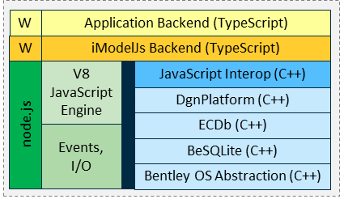

## What is an iTwin?

An iTwin is an infrastructure digital twin.

An iTwin incorporates different types of data repositories – including drawings, specifications, documents, analytical models, photos, reality meshes, IoT feeds, and enterprise resource and enterprise asset management data – into a living digital twin.  Please Go [here](http://www.bentley.com/itwin) to get additional information about iTwins and Bentley iTwin Services

## What is an iModel?

Overview

* Contains digital components assembled from many sources
* Based on open source SQLite relational database format
* Backbone for iTwins

Details

* An iModel is a specialized information container for exchanging data associated with the lifecycle of infrastructure assets.
* iModels are self-describing, geometrically precise, open, portable, and secure.
* iModels were created to facilitate the sharing and distribution of information regardless of the source and format of the information.
* iModels are an essential part of the digital twin world. But a digital twin means a lot more than just an iModel.

## iTwin Connectors

As explained in the [overview](../learning/imodel-connectors.md), a "connector" is a program that:

1. Reads information from a data source,
2. Aligns the source data with the BIS schema and preferably a domain schema, and
3. Writes BIS data to an iModel.

iTwin connectors play an important role in enabling a wide range of both Bentley and third-party design applications to contribute to an iTwin.

Bentley iTwin Services provides connectors to support a wide array of design applications to ensure all of the engineering data can be aggregated into a single digital twin environment inside an iModel.

A complete list of available connectors can be found in [iTwin Services Community Wiki](https://communities.bentley.com/products/digital-twin-cloud-services/itwin-services/w/synchronization-wiki/47595/supported-applications-and-file-formats)

Examples of iTwin Connector include:

See [Section on iTwin Synchronization](#ways-to-sync-data-to-an-itwin) for more details on existing connectors.

However in certain cases, where a specific format is not covered, one can develop a new connector using  [iModel.js SDK](https://www.itwinjs.org/)

The imodel-bridge package provided as part of the iModel.js SDK makes it easier to write an iTwin connector backend that brings custom data into a digital twin. To run this environment with the iModel.js library that this package depends on requires JavaScript engine with es2017 support.

Note: Please keep in mind iModelBridge is sometimes used as a synonym for iTwin Connector since it bridges the gap between input data and a digital twin.
