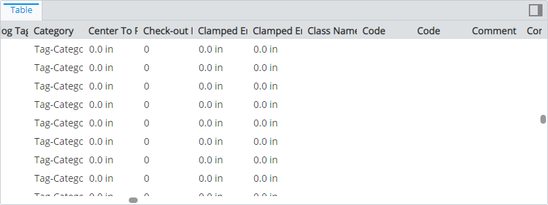
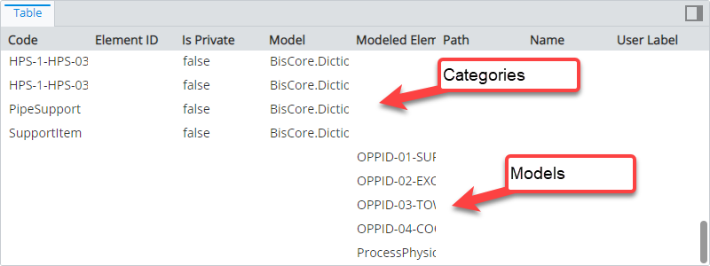

# Content rule

> TypeScript type: [ContentRule]($presentation-common).

Content rules are used to define content that is displayed for specific type of [input](./Terminology.md#input-instance). Input consists of either ECInstances or [nodes](../hierarchies/Terminology.md#node) and to make things simpler everything is considered a [node](../hierarchies/Terminology.md#node) - instances get converted to _ECInstance nodes_ (thus the `SelectedNode` symbol in [`condition` ECExpression](./ECExpressions.md#rule-condition)).

## Attributes

| Name                                              | Required? | Type                                                                 | Default |
| ------------------------------------------------- | --------- | -------------------------------------------------------------------- | ------- |
| _Picking attributes_                              |
| [`condition`](#attribute-condition)               | No        | [ECExpression](./ECExpressions.md#rule-condition)                    | `""`    |
| [`requiredSchemas`](#attribute-requiredschemas)   | No        | [`RequiredSchemaSpecification[]`](../RequiredSchemaSpecification.md) | `[]`    |
| [`priority`](#attribute-priority)                 | No        | `number`                                                             | `1000`  |
| [`onlyIfNotHandled`](#attribute-onlyifnothandled) | No        | `boolean`                                                            | `false` |
| _Content attributes_                              |
| [`specifications`](#attribute-specifications)     | Yes       | `ContentSpecification[]`                                             |         |

### Attribute: `condition`

Defines a condition which needs to be met in order for the rule to be used. The condition is an [ECExpression](./ECExpressions.md#rule-condition) which has to evaluate to a boolean value.

|                   |                                                   |
| ----------------- | ------------------------------------------------- |
| **Type**          | [ECExpression](./ECExpressions.md#rule-condition) |
| **Is Required**   | No                                                |
| **Default Value** | `""`                                              |

The most commonly used symbols are:

- `SelectedNode` to define which type of [input](./Terminology.md#input-instance) this rule is creating content for.

  ```ts
  [[include:Presentation.ContentRule.Condition.SelectedNodeSymbol]]
  ```

  | Input instance | Result                                                                                                                                       |
  | -------------- | -------------------------------------------------------------------------------------------------------------------------------------------- |
  | `bis.Element`  |  |
  | `bis.Model`    |      |

- [Ruleset variables](../advanced/RulesetVariables.md#using-variables-in-rule-condition) to dynamically enable / disable the rule.

  ```ts
  [[include:Presentation.ContentRule.Condition.RulesetVariables.Ruleset]]
  ```

  | Ruleset variable values                                    | Result                                                                                                                         |
  | ---------------------------------------------------------- | ------------------------------------------------------------------------------------------------------------------------------ |
  | `DISPLAY_CATEGORIES = false`<br />`DISPLAY_MODELS = false` |                                        |
  | `DISPLAY_CATEGORIES = false`<br />`DISPLAY_MODELS = true`  |  |
  | `DISPLAY_CATEGORIES = true`<br />`DISPLAY_MODELS = true`   |      |

### Attribute: `requiredSchemas`

A list of [ECSchema requirements](../RequiredSchemaSpecification.md) that need to be met for the rule to be used.

|                   |                                                                      |
| ----------------- | -------------------------------------------------------------------- |
| **Type**          | [`RequiredSchemaSpecification[]`](../RequiredSchemaSpecification.md) |
| **Is Required**   | No                                                                   |
| **Default Value** | `[]`                                                                 |

```ts
[[include:Presentation.ContentRule.RequiredSchemas.Ruleset]]
```

### Attribute: `priority`

Defines the order in which rules are handled - higher priority means the rule is handled first. If priorities are equal, the rules are handled in the order they're defined. The attribute may be especially useful when combined with [`onlyIfNotHandled` attribute](#attribute-onlyifnothandled).

|                   |          |
| ----------------- | -------- |
| **Type**          | `number` |
| **Is Required**   | No       |
| **Default Value** | `1000`   |

```ts
[[include:Presentation.ContentRule.Priority.Ruleset]]
```


### Attribute: `onlyIfNotHandled`

When `true`, the rule takes effect only when all other content rules with higher priority are ruled out. This attribute is most useful for defining fallback rules.

|                   |           |
| ----------------- | --------- |
| **Type**          | `boolean` |
| **Is Required**   | No        |
| **Default Value** | `false`   |

```ts
[[include:Presentation.ContentRule.OnlyIfNotHandled.Ruleset]]
```


### Attribute: `specifications`

A list of content specifications that define what content is going to be returned. This is the most important attribute which is responsible for defining what instances' properties are included in the returned content. There are 4 types of specifications:

- [Selected node instances](./SelectedNodeInstances.md) specification returns properties of the [input instance](./Terminology.md#input-instance).
- [Content instances of specific classes](./contentInstancesOfSpecificClasses.md) specification returns properties of instances of given classes. The returned content doesn't depend on the [input](./Terminology.md#input-instance).
- [Content related instances](./contentRelatedInstances.md) specification returns properties of instances that are related to [input instances](./Terminology.md#input-instance) through given relationship(s).

Multiple specifications can contribute to the resulting content by specifying multiple specifications in a single [content rule](./contentRule.md) or specifying multiple rules that match the same input.

|                 |                          |
| --------------- | ------------------------ |
| **Type**        | `ContentSpecification[]` |
| **Is Required** | Yes                      |
